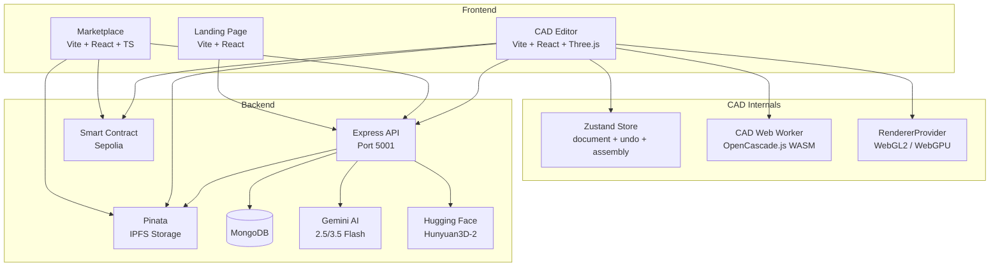

# ChainTorque

### _Web3 Engineering Platform with Browser-Based CAD Editor_

> **ChainTorque** revolutionizes 3D model platforms by combining blockchain technology, professional CAD tools, and real-time 3D interaction to create a secure, transparent, and intelligent platform for engineering assets.

## 🚀 **What is ChainTorque?**

ChainTorque is a comprehensive Web3 platform that solves critical problems in the 3D engineering space:

- **🛡️ NFT-Based Licensing**: Blockchain-verified ownership and licensing
- **🎮 Interactive 3D Previews**: Inspect models before purchasing
- **🎨 Browser-Based CAD Editor**: Professional 2D sketching + 3D modeling with OpenCascade.js
- **🌐 Decentralized Storage**: IPFS integration via Pinata for censorship resistance
- **💰 Direct Creator Payments**: Customizable creator royalties + 2.5% platform fee via smart contracts

## 🏗️ **Project Structure**

```
ChainTorque/
├── Landing Page (Frontend)/     # Vite + React marketing site (Port 5000)
├── Marketplace (Frontend)/      # Vite + React + TypeScript NFT marketplace (Port 8080)
├── CAD (Frontend)/              # Vite + React CAD editor with OpenCascade.js (Port 3001)
└── backend/                     # Express API + Hardhat Smart Contracts (Port 5001)
```

## 🛠️ **Technologies Used**

| Layer | Technologies |
|-------|--------------|
| **Runtime** | Bun (3x faster than Node.js) |
| **Frontend** | React 19, Vite 6, Three.js r179, @react-three/fiber v9, Tailwind CSS |
| **CAD Engine** | OpenCascade.js 1.1.1 (WASM), comlink Web Worker, Custom 2D Canvas |
| **State** | Zustand 5 (document store + undo/redo + clipboard + assembly) |
| **Performance** | three-mesh-bvh (O(log n) raycasts), LOD mesh decimation, adaptive DPR |
| **AI** | Gemini (2.5/3.5 Flash) for Torquy CAD assistant; Hugging Face / Hunyuan3D-2 for Image-to-3D |
| **Android** | Kotlin, Jetpack Compose, Hilt DI, WalletConnect v2 (Reown AppKit), ARCore |
| **Backend** | Express, MongoDB, IPFS (Pinata SDK), Gradio (Hunyuan3D-2) |
| **Blockchain** | Solidity (ERC-721), Hardhat, Ethereum Sepolia, ethers.js v5 |
| **Auth** | Clerk (Web3 wallet + social login) |
| **Deployment** | Render.com (4 services) |

## 🎨 **CAD Editor Features**

The browser-based CAD editor (`CAD (Frontend)/`) provides:

### 2D Sketching Tools
- **Line Tool** (L): Draw connected line segments
- **Polygon Tool** (P): Create closed polygon shapes
- **Circle Tool** (C): Draw circles with center + radius
- **Arc Tool** (A): Bézier-curved arc segments between two points
- **Cut Tool**: Trim / split edges at intersection points
- **Point Tool**: Add constraint points to existing edges
- **Grid Snap**: Automatic alignment to grid
- **Undo/Redo**: Backspace to undo last point; global Ctrl+Z / Ctrl+Y history

### 3D Modeling
- **Sketch Extrusion**: Convert 2D polygons, line loops, and circles to 3D solids via OpenCascade.js
- **Add Primitives**: Insert analytic solids (Cube, Sphere, Cylinder, Cone) at any size
- **Real-time Preview**: Three.js powered 3D viewport with orbit controls and double-sided grid rendering (fully visible from all viewing angles)
- **Vertex Edit Mode**: Select and drag individual mesh vertices; changes persist in the document store
- **View Controls**: Front, Top, Right, Isometric camera presets, and a custom **SolidWorks Reference Triad** coordinate indicator (Red X, Green Y, Blue Z thin cylinders, arrowheads, and floating text labels) with click-to-snap camera tweens
- **Theme Selector**: Settings panel option to toggle between Dark (high contrast), Light (White Mode matching SolidWorks default canvas and gradient backgrounds), and System auto-detect
- **2D / 3D / Edit Toggle**: Seamless switching between sketch, model, and mesh-edit modes
- **`?model=<url>` Loading**: Load any public GLB into the editor via URL query parameter

### CAD Kernel
- **OpenCascade.js**: Industry-standard BREP geometry kernel (WASM), runs in a Web Worker via comlink with automatic main-thread fallback
- **Primitives**: Box, Cylinder, Sphere, Cone (full frustum support — `radiusTop > 0` creates a truncated cone)
- **Boolean Operations**: Union, Cut (Subtract), Intersection — all use `TopTools_ListOfShape` as required by the OCC API
- **Memory Managed**: Every WASM object cleaned up with `safeDelete`; typed arrays never cross the worker boundary as BREP handles

### Assembly System
- **Parts**: Bundle one or more solid features into a named, reusable part
- **Instances**: Place unlimited copies of a part — one `InstancedMesh` per distinct part (~1 draw call per part)
- **Stamp Instance**: Grid-fan auto-placement via Command Palette or the toolbar
- **Undo/Redo**: Assembly mutations (create part, add / remove instance) are included in the 50-step undo history

### Performance
- **BVH Acceleration**: three-mesh-bvh monkey-patches `BufferGeometry.raycast` → O(log n) picking on large assemblies
- **LOD Mesh Decimation**: Solids > 4 000 vertices get 50 % and 80 % simplified copies swapped in at 18 and 45 units distance (`SimplifyModifier`)
- **Adaptive Quality**: Device probe (CPU cores, GPU renderer string, `deviceMemory`) auto-tunes DPR, shadows, and antialiasing for low-end devices
- **Demand Frameloop**: Canvas only re-renders when the document changes (not continuously)

### Renderer
- **WebGL 2** (default): `high-performance` power preference, MSAA antialias, `preserveDrawingBuffer`
- **WebGPU** (opt-in): `localStorage.setItem('ct_cad_webgpu','1')` then reload; falls back to WebGL 2 if WebGPU init fails

### AI Features
- **Torquy AI Assistant**: Natural-language CAD commands powered by Gemini (2.5/3.5 Flash). Generates 3D CSG assemblies (`shapes` + `boolean_operations`) or 2D sketch polygons/circles in a selectable 2D / 3D generation mode. Maintains multi-turn chat history (last 6 messages sent for context).
- **Image-to-3D**: Upload any 2D image; Hunyuan3D-2 (via Gradio on Hugging Face) reconstructs a GLB model and loads it directly into the viewport.

### Save / Load & Export
- **Auto-save to localStorage**: Ctrl+S saves the full document (features, sketches, parts, instances, camera, view mode). Page reload restores everything — typed arrays (`Float32Array` / `Uint32Array`) survive the JSON round-trip via flatten/rehydrate.
- **Export as GLB**: `GLTFExporter` packages all solid features into a binary `.glb` file, downloadable from the toolbar.
- **Publish to Marketplace**: 3-step wizard (Details → Pricing → Preview & Submit) uploads GLB + preview screenshot to IPFS, then mints an ERC-721 NFT on Sepolia — all from inside the editor.

### Keyboard Shortcuts
| Key | Action |
|-----|--------|
| L | Line tool |
| P | Polygon tool |
| C | Circle tool |
| A | Arc tool |
| I | Toggle 3D view |
| Enter | Save sketch / confirm |
| ESC | Cancel / Back to 2D |
| Backspace | Undo last point (2D) |
| Arrow Keys | Pan canvas (2D) |
| Scroll | Zoom |
| Ctrl+Z | Undo |
| Ctrl+Y / Ctrl+Shift+Z | Redo |
| Ctrl+C | Copy selected feature |
| Ctrl+V | Paste feature |
| Ctrl+S | Save project |
| Ctrl+K | Command Palette |

### Command Palette (Ctrl+K)
Blender-style fuzzy-search palette. Registered commands include: Save Project, New Project, Clear All, Create Part from Selection, Stamp Instance of Last Part, Undo, Redo, Focus Selection, and more.

## 🚀 **Quick Start**

### Prerequisites
Install [Bun](https://bun.sh) - a fast all-in-one JavaScript runtime:
```sh
# Windows (PowerShell)
powershell -c "irm bun.sh/install.ps1|iex"

# macOS/Linux
curl -fsSL https://bun.sh/install | bash
```

### Installation & Running
```sh
# Clone and install
git clone https://github.com/Dealer-09/Chain-Torque.git
cd Chain-Torque
bun install

# Start all services (Landing, Marketplace, Backend, CAD)
bun run dev

# Or run individual services
bun run dev:landing      # Landing page (Port 5000)
bun run dev:marketplace  # Marketplace (Port 8080)
bun run dev:backend      # Backend API (Port 5001)
bun run dev:cad          # CAD editor (Port 3001)
```

## 🗺️ **Development Status**

### ✅ Completed
- [x] Bun monorepo with npm workspaces
- [x] 3D marketplace with NFT minting & purchasing
- [x] Decentralized purchase flow (MetaMask → Smart Contract → IPFS)
- [x] ETH payments: Configurable creator royalties on secondary sales & 2.5% platform fee
- [x] Relist/resale functionality for secondary market
- [x] Smart contract deployed on Sepolia testnet
- [x] IPFS storage via Pinata SDK
- [x] Search & category filtering
- [x] Purchased items with download links
- [x] Dashboard with user stats
- [x] Clerk authentication integration
- [x] **CAD Editor with OpenCascade.js**
  - [x] 2D Canvas with Line, Polygon, Circle, Arc tools
  - [x] Cut and Point edge-editing tools
  - [x] Grid snap and pan/zoom controls
  - [x] Sketch extrusion to 3D solids (polygons, line loops, circles → analytic cylinders)
  - [x] Add analytic primitives: Cube, Sphere, Cylinder, Cone
  - [x] Boolean Operations: Union, Cut, Intersection (sidebar panel + Torquy AI)
  - [x] Three.js 3D viewport with orbit + transform controls
  - [x] Vertex Edit Mode (MeshEditor) — select and drag individual mesh vertices
  - [x] Feature Tree with visibility toggle & delete
  - [x] Assembly system: Parts + Instanced rendering (InstancedMesh, ~1 draw call/part)
  - [x] Command Palette (Ctrl+K) with fuzzy search
  - [x] Undo/Redo (50-deep) covering features, sketches, parts, instances
  - [x] Copy/Paste features (Ctrl+C / Ctrl+V)
  - [x] Save/Load to localStorage (Ctrl+S) with typed-array serialization
  - [x] GLB export via GLTFExporter
  - [x] Publish to Marketplace (IPFS + on-chain NFT mint directly from editor)
  - [x] BVH-accelerated raycasting (three-mesh-bvh)
  - [x] LOD mesh decimation for large solids (SimplifyModifier, 2 LOD levels)
  - [x] Adaptive render quality (DPR / shadows / antialias by device)
  - [x] WebGPU opt-in renderer with graceful WebGL2 fallback
  - [x] Load any GLB via `?model=<url>` query parameter
  - [x] Performance stats overlay (FPS / draw calls / tris / geometry / textures)
  - [x] Production build optimized
- [x] **AI Features**
  - [x] Torquy AI CAD assistant (Gemini 2.5/3.5 Flash) — 3D CSG + 2D sketch generation with chat history
  - [x] Image-to-3D (Hunyuan3D-2 via Gradio / Hugging Face)
- [x] Render.com deployment (all 4 services)
- [x] **Native Android App** (Moved to independent repo: [ChainTorque_Native](https://github.com/Dealer-09/ChainTorque_Native))
  - [x] Jetpack Compose UI with Material 3
  - [x] WalletConnect v2 integration (300+ wallet support: MetaMask, Trust Wallet, Rainbow, etc.)
  - [x] NFT marketplace browsing & purchasing
  - [x] AR & 3D model viewing (Google Scene Viewer + ARCore integration)
  - [x] User profiles and transaction history
  - [x] Sepolia testnet enforcement with session validation

  - [x] SolidWorks genuine wireframe reference triad coordinate indicator (Red/Green/Blue shafts, arrowheads, text labels, and camera snapping)
  - [x] Viewport settings theme selector (Dark / Light / System auto-detect)

### 🔄 In Progress
- [ ] Parametric constraints / dimensions in 2D sketcher
- [ ] Multi-chain support (Polygon)

### 📋 Planned
- [ ] STL export from CAD editor
- [ ] User profile pages
- [ ] VR model preview (AR completed on Android)

## 🏗️ **Architecture**



## 🔒 **Environment Variables**

Create `.env` in the project root:
```env
# MongoDB
MONGODB_URI=mongodb+srv://...

# Ethereum
RPC_URL=https://sepolia.infura.io/v3/...
PRIVATE_KEY=your_wallet_private_key
CONTRACT_ADDRESS=0x...

# Clerk Auth
VITE_CLERK_PUBLISHABLE_KEY=pk_...
CLERK_SECRET_KEY=sk_...

# IPFS (Pinata)
PINATA_JWT=...
PINATA_API_KEY=...
PINATA_API_SECRET=...

# AI Services
GEMINI_API_KEY=...      # Torquy AI shared fallback (CAD assistant)
HF_TOKEN=...            # Image-to-3D (Hunyuan3D-2 via Gradio)
```

## 🤝 **Contributing**

We welcome contributions! Areas of focus:

- **🎨 CAD Features**: Parametric constraints, STL export, multi-body solids
- **🤖 AI Integration**: Richer Torquy context (workspace dimensions, existing features)
- **🔧 Blockchain**: Smart contract optimization, multi-chain
- **📝 Documentation**: API docs, tutorials

## 📄 **License**

MIT License - see [LICENSE](LICENSE) for details.

---

<div align="center">

**🔗⚙️ Building the Future of Engineering, One Block at a Time**

[](#quick-start)
[](#cad-editor-features)
[](#contributing)

</div>